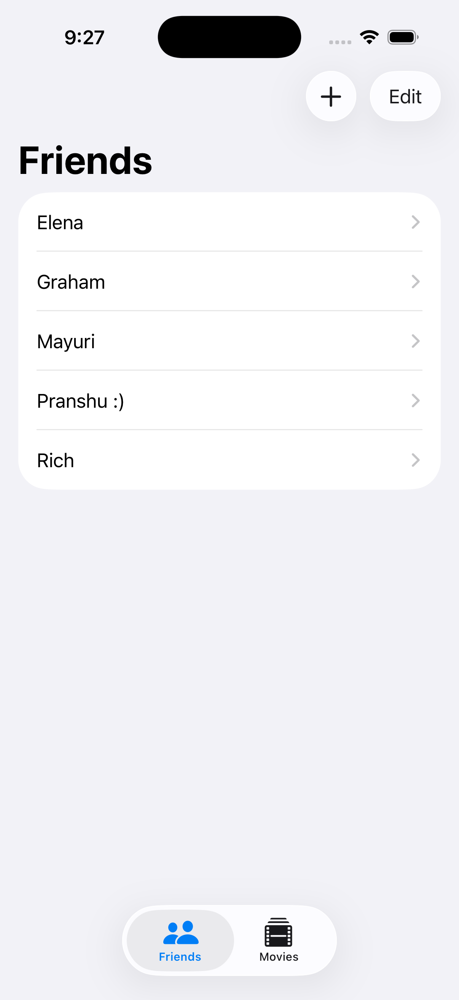
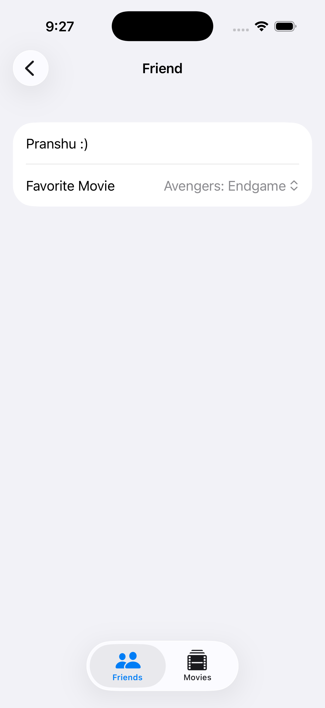
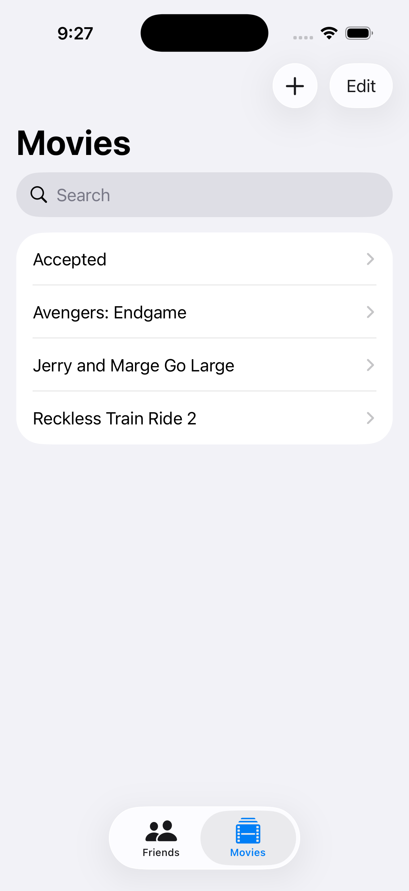
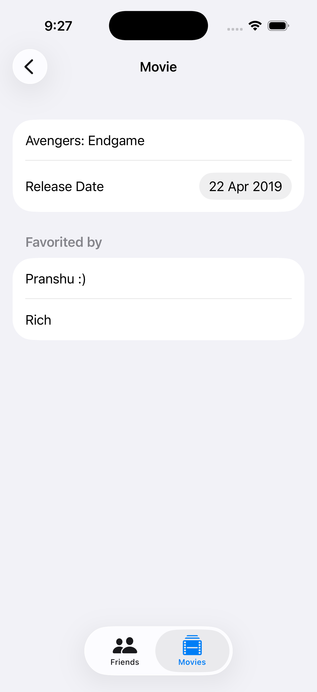

# FriendsFavoriteMovies

A minimal iOS app to track friends and their favorite movies. This README provides a quick overview, how to build/run, and a few screenshots.

## Overview
- Browse a list of friends
- View each friend's favorite movies
- Add or edit entries

## Requirements
- Xcode 15 or later
- iOS 17 or later (target may vary based on project settings)
- Swift and SwiftUI

## Getting Started
1. Open the project in Xcode: `FriendsFavoriteMovies.xcodeproj` or the workspace if present.
2. Select an iOS Simulator (e.g., iPhone 15). 
3. Build and run (Cmd+R).

## Project Structure
- App entry point and SwiftUI views
- Models for friends and movies
- Simple data layer (in-memory or sample data)

## Screenshots

- Friends-List/Detail View:
  

- Detail View:
  

